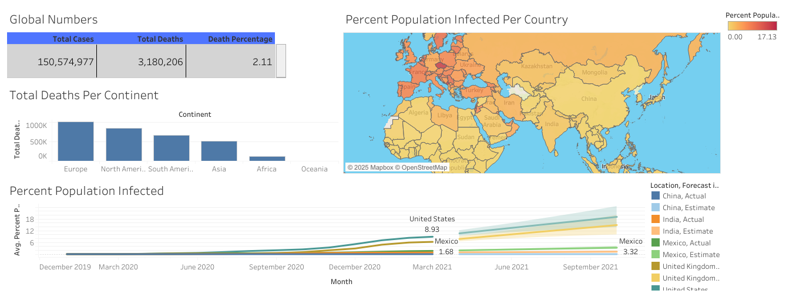

# COVID-19 Data Analysis and Visualization

## Project Overview

This project demonstrates my work on COVID-19 data analysis and visualization using SQL, Excel, and Tableau. By analyzing publicly available COVID-19 data, I explored key metrics such as global cases, deaths, death percentages, and the percentage of population infected per country. The main focus of this project is to create a dynamic Tableau dashboard to visually represent the findings, making it easier to comprehend and analyze the impact of COVID-19 globally and continentally.

## Project Files

- **SQL Queries**: Contains all SQL scripts used for data analysis. The file is named:
  - `Tableau Portfolio Project SQL Queries.sql`
- **Excel Files**: Stored query outputs in Excel for further use in Tableau. Files include:
  - `Tableau Table 1.xlsx`
  - `Tableau Table 2.xlsx`
  - `Tableau Table 3.xlsx`
  - `Tableau Table 4.xlsx`
- **Tableau Dashboard**: Integrated the processed data into Tableau to create an interactive visualization dashboard, provided as the Tableau workbook file:
  - `Covid Dashboard.twb`

## Key Insights from the Dashboard

1. **Global Numbers**:

   - Total Cases: 150,574,977
   - Total Deaths: 3,180,206
   - Death Percentage: 2.11%

2. **Total Deaths Per Continent**:

   - Europe and North America recorded the highest number of deaths, each exceeding 500,000.
   - Africa and Oceania had significantly lower death counts.

3. **Percent Population Infected Per Country**:

   - The percentage of infected population varies significantly by country.
   - The United States shows a higher infection percentage (8.93%) compared to Mexico (3.32%) and other countries.

4. **Infection Trends Over Time**:

   - The trendline visualizes the infection rate progression for selected countries like the United States, Mexico, India, and China, with both actual and estimated data points.

## Dashboard Preview

Below is a snapshot of the Tableau dashboard:



To experience the interactivity, open the Tableau workbook file:
- **File Location**: `Tableau/Covid Dashboard.twb`


## How to Use the Project

1. Clone the repository:
   ```bash
   git clone https://github.com/vsumitwork/COVID-19-Data-Analysis-and-Visualization.git
   ```
2. Open the SQL file (`Tableau Portfolio Project SQL Queries.sql`) to view and run the queries.
3. Use the Excel files to view the raw data processed from SQL queries.
4. Open the Tableau file (`Covid Dashboard.twb`) in Tableau to explore the interactive dashboard.

## Tools Used

- **SQL Server Management Studio (SSMS)**: For running queries to extract insights from the dataset.
- **Microsoft Excel**: For storing query results and preparing the data for Tableau.
- **Tableau**: For creating an interactive dashboard to visualize the data.

## Learning Outcomes

- Improved my skills in data extraction, transformation, and visualization.
- Gained experience in using Tableau to communicate data insights effectively.
- Developed an understanding of global and regional COVID-19 trends and their impact.

## Future Scope

- Include more datasets to analyze vaccination rates and their correlation with infection and death rates.
- Add predictive modeling to forecast future trends.

## Acknowledgments

- The data used in this project is sourced from publicly available COVID-19 datasets.
- Inspired by the need to communicate data insights effectively through interactive dashboards.
- Special thanks to the creators of the public datasets and the Tableau community for their tools and resources.

## Contact

For any questions or suggestions, feel free to reach out via [GitHub](https://github.com/vsumitwork).

